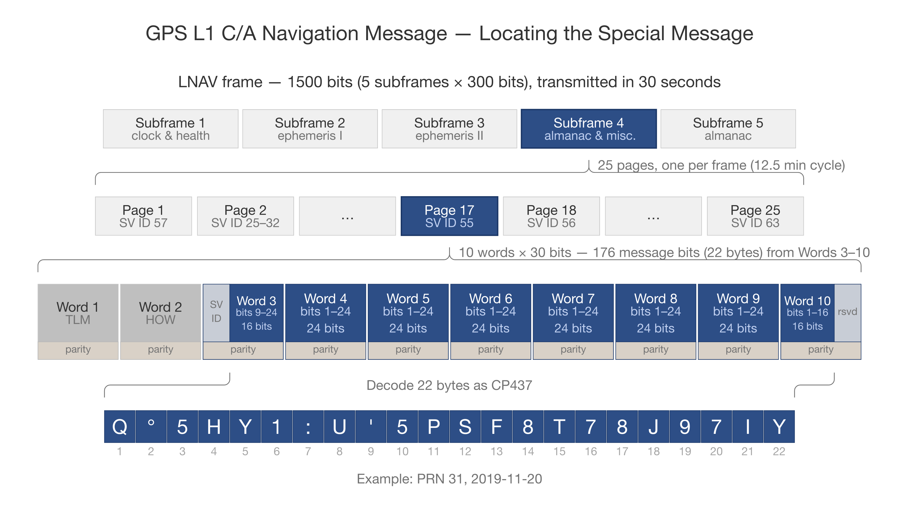
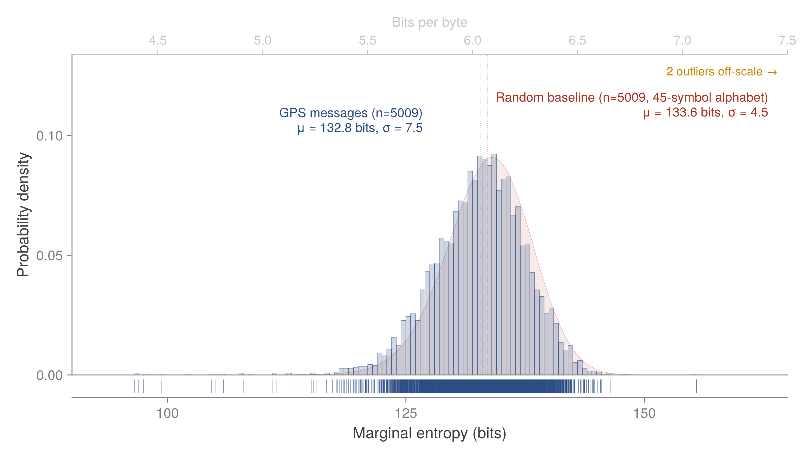
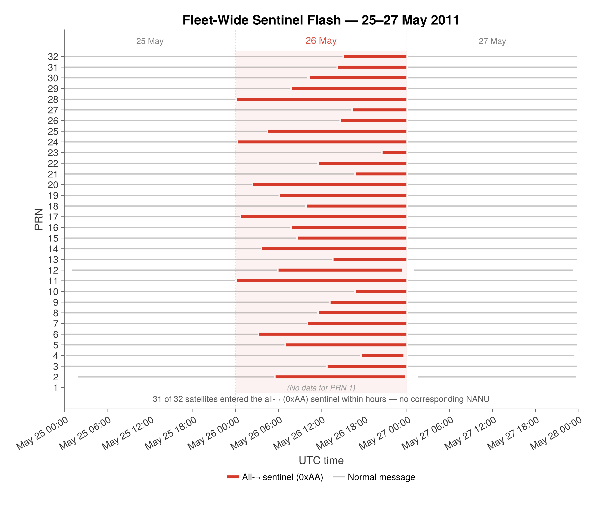
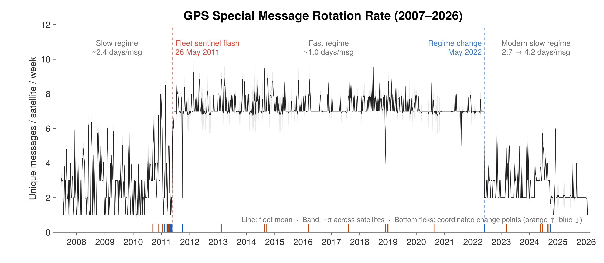
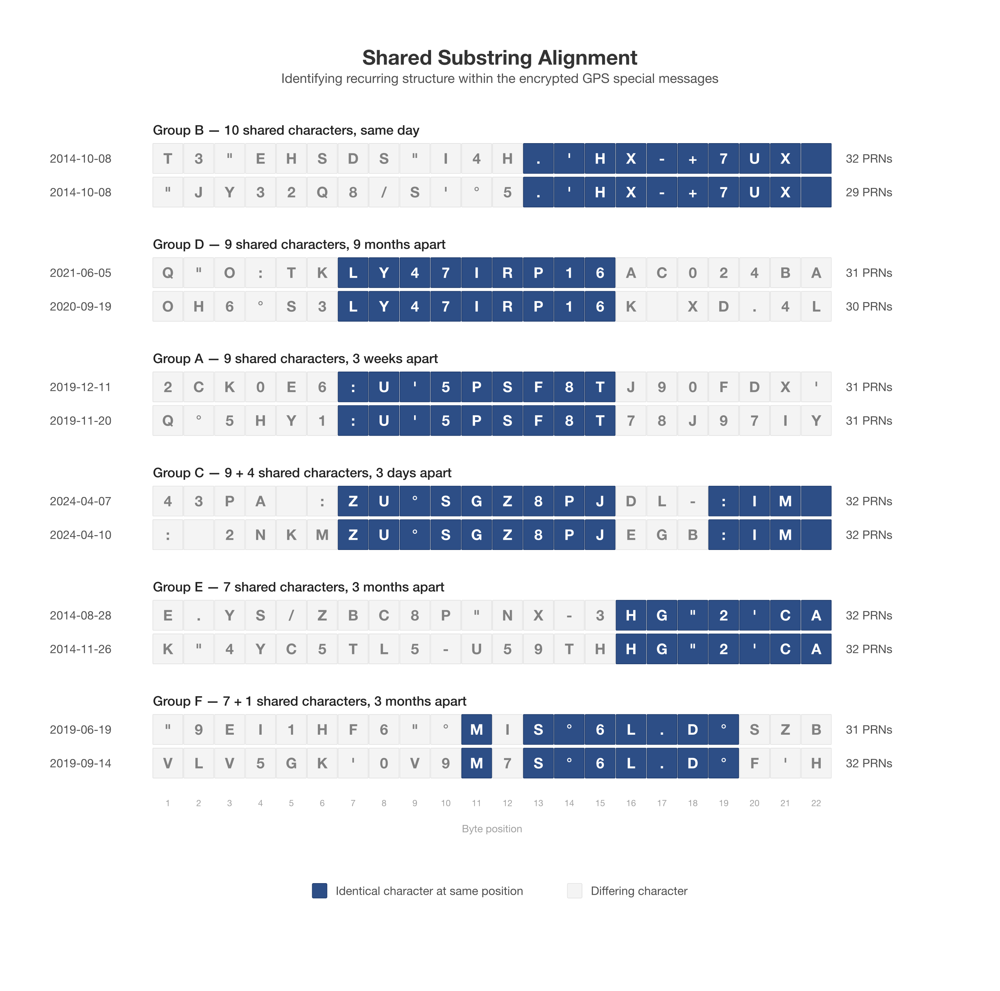
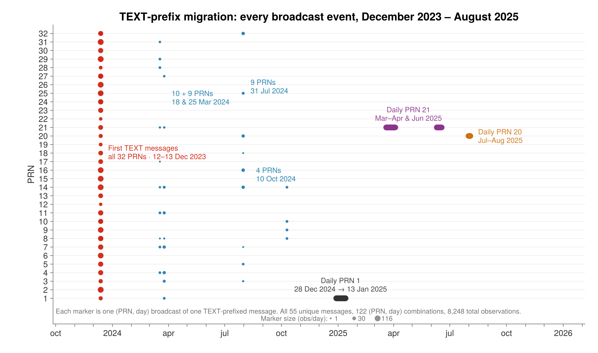

# The Empty Field That Wasn't: GPS, OTAD and Two Decades of Encrypted Broadcasts

What 24 million GPS special messages reveal about military rekeying on a public channel.

**Steven J. Murdoch**.
University College London

> **Version 2 — updated and expanded (June 2026).** This is a new version of the article originally published in *Inside GNSS*, May/June 2026. The dataset used for the original article erroneously omitted bit-flipped frames. This new version of the article updates the analysis to take into account the additional special messages found by the modified decoder. The substantive conclusions in the original article remain unchanged, but some details have been updated and expanded. The complete update record is in the [changelog](../CHANGELOG.md); the original numbers remain reproducible from the archived v1 dataset on Zenodo.

Cold War shortwave numbers stations broadcast strings of digits to anonymous listeners, content that's meaningless to anyone without a matching one-time pad. They still operate today.

As it turns out, GPS broadcasts in much the same way.

Buried in every L1 C/A navigation message is Subframe 4, Page 17—a 176-bit field that IS-GPS-200 reserves for "special messages with the specific contents at the discretion of the Operating Command."[^1] Every satellite broadcasts it. Every receiver decodes the subframe that contains it. And for nearly two decades, no one has publicly explained what it contains.

We analyzed 24.09 million observations in this field from 2007 through early 2026.[^2] The content is not text. It is encrypted material consistent with the military's Over-the-Air Distribution (OTAD) global rekeying network.[^3] For 19 years, every operational GPS satellite has been a numbers station—broadcasting ciphertext on a public channel, to billions of receivers, in plain sight.

If you build receivers, write firmware, run signal monitoring, or care about the gap between civil and military signal transparency, this is your field too. You just have not been reading it.

What follows is the story of how a forgotten 176-bit slot in the world's most successful navigation signal turned out to be its quietest and most consequential broadcast—and how a few weeks of analysis on a laptop, applied to 19 years of public archive data, was enough to read its operational history off the bytes.

## 176 Bits, Eight Words, One Forgotten Page

The L1 C/A signal carries 50 bits per second.[^4] Every bit must earn its place. The Legacy Navigation message organizes those bits into 1,500-bit frames, each frame into five 300-bit subframes, each subframe into ten 30-bit words. Subframes 1 to 3 carry the heavy work—clock corrections, ephemeris, the data your receiver needs every few seconds. Subframes 4 and 5 multiplex 25 rotating pages. A receiver sees Page 17 of Subframe 4 every 12.5 minutes.[^5]

Across 32 satellites, that is roughly 3,700 special-message payloads per day, fleet-wide.[^6] Multiplied across 19 years and the global ground-station archive, the figure climbs to 24.09 million observations.

176 bits is barely enough for a few floating-point numbers, but in a 50 bps signal, it is roughly 12% of the LNAV frame that carries it.[^7] For the control segment to use that bandwidth consistently for two decades implies the content matters—even if no civilian receiver has ever rendered it.

**Figure 1** shows how the bits are arranged. The 176-bit payload is fragmented across Words 3 to 10 of Subframe 4, Page 17: 16 data bits in Word 3 (after eight bits of Data ID and SV ID = 55, the marker that identifies Page 17),[^8] 24 data bits in each of Words 4 to 9, and 16 data bits in Word 10. The final six bits of every word carry the parity bits.[^9] After parity stripping and reassembly, the 22 bytes of payload are decoded under a subset of Code Page 437.

## Mining 19 Years of Navbits

The corpus comes from the GFZ Potsdam open archive of GNSS recordings collected from a wide network of ground stations, dating back to 2007.[^10] After extraction, the numbers settle: 24.09 million observations of Subframe 4, Page 17, drawn from every operational PRN, spanning 19 years, yielding 5,009 unique 176-bit messages.

Initial Python implementations needed hours to process a single year. To make iterative analysis practical, we wrote a Julia pipeline: NetCDF source files are converted to Apache Arrow, then thread-parallel bit extraction is performed into a DuckDB database. The full from-raw rebuild runs unattended in under a day, and SQL across the lot returns in milliseconds.[^11]

With 24.09 million payloads in a queryable database, the question becomes: What does this field actually contain?

## It Is Not Text. It Never Was.

The first thing a researcher tries in an unknown field is the obvious one: maybe it is text in a different encoding. We computed the frequency of each of the 45 alphabet symbols defined by IS-GPS-200[^12] across all 5,009 unique messages. In English, frequencies have a fingerprint—E and T are common, J and Z are rare, spaces and full stops are more common than digits. In a uniform random stream, each of the 45 symbols should appear with probability one in 45—about 2.22%.

The observed frequencies tracked the uniform baseline with remarkable precision. A chi-squared test against uniform yielded χ² = 58.99 over 44 degrees of freedom—a z-score of 1.60, well inside the range where we cannot reject the null hypothesis of randomness.[^13] The distribution is statistically indistinguishable from random data.

A stronger test asks the same question from a compression angle: How much information does each unique message contribute, given the others? An order-8 PPM-D compression model trained on the full corpus measures the marginal entropy of each payload—the additional cost, in bits, of encoding that message given everything else the model has seen.[^14] Real text would compress: Any recurring phrase, formatting block, or repeated formula would become almost free to code. Random data would not. **Figure 2** plots the resulting distribution alongside a synthetic random baseline of 5,009 messages drawn uniformly from the 45-symbol alphabet and scored against the same model. The two distributions overlap almost perfectly, with means within a bit of each other. By every available statistical lens, the GPS messages are almost indistinguishable from random,[^15] but there are intriguing outliers. At the lower end, messages are much more predictable than you would expect from random data; at the higher end, sentinels stand out from the rest. In **Figure 2,** blue indicates the marginal coding cost of each of the 5,009 unique 22-byte payloads under an order-8 PPM-D model trained on the corpus (µ ≈ 132.8 bits per message ≈ 6.0 bits per byte, σ ≈ 7.5). Red indicates the same model scored against a synthetic baseline of 5,009 messages drawn uniformly from the 45-symbol GPS alphabet (µ ≈ 133.6 bits, σ ≈ 4.5). The excess spread in the GPS data comes from a small set of structurally non-random outliers—the subject of the rest of this article.

The next issue is that high-entropy output can come from encryption, compression or genuine randomness, and entropy alone cannot tell us which.

This is correct. It is also the entry point to the rest of the article. If the field is encrypted, the protocol shape may still leave traces—placeholders where no payload is loaded, regime changes where policy shifts. In these structural metadata, the cipher does not reach. Encryption doesn't hide "traffic data" of when and how often messages are sent and from which satellites. Each of those is a crack in the randomness, and the rest of this story walks through them in order.

What the entropy result does close off is the comfortable interpretation. Between 2007 and late 2023, no readable English appears anywhere in the dataset.[^16] No call signs, no acknowledgments, no test patterns of "the quick brown fox" variety. The field has not carried text in any conventional sense for the entire archived history of the GPS constellation.

For an engineer, that absence is itself information. The interface specification says this field is for text from the control segment. The bytes flatly disagree, and they have done so consistently, across every satellite, for 19 years.

High entropy on its own tells us only what the field is not. To learn what it is, we had to look for the cracks in the randomness.

## A Single Byte, Repeated 22 Times, for 10 Years

The first crack in the randomness is also the most visible. Three messages, out of 5,009, have Shannon entropy of exactly zero.[^17] They are sentinels: 22 consecutive identical bytes broadcast as a single repeating pattern across the full payload.[^18]

- All-spaces—22 of byte 0x20.

- All-NUL—22 of byte 0x00.

- All-¬ —22 of byte 0xAA, the CP437 negation glyph.[^19]

The all-¬ pattern is the longest-lived artifact in the dataset. It first appears on PRN 25 in February 2010, and quickly becomes the dominant default for the constellation, persisting intermittently across all 32 satellites for more than a decade.[^20]

The choice of byte 0xAA is not accidental. In binary, it is the perfectly alternating bit pattern 10101010—the canonical test sequence for bit synchronization, parity verification, and frame-alignment checks in receiver hardware.[^21] A satellite broadcasting all-¬ is broadcasting the protocol equivalent of a tone: present, parseable and intentionally empty. It is also outside of the characters permitted in the special message field, causing receivers to flag up data validation errors.

That intentionality matters. Encryption alone does not produce a constant. A genuinely random stream visits all-0xAA with negligible probability. The sentinels are placeholders by design—slots in the protocol marked as "no operational payload loaded."

Does their timing fit that reading? Partly; cross-referencing all 212 sentinel transitions against GPS status reports (Notice Advisory to Navstar Users—NANU) finds no statistically significant correlation with satellite lifecycle events: the match rate is no better than chance (p = 0.87), and most sentinel windows come and go without any corresponding public notice.[^22] However, there are instances that match the expected use of the placeholder sentinel. The Block IIA satellite broadcasting as PRN 25 was decommissioned in December 2009.[^23] By February 2010, the slot was broadcasting all-¬. Its replacement, the first Block IIF, launched in May 2010, began pre-commissioning tests in August and also broadcast the all-¬ sentinel for several days before being declared usable at the end of August.[^24] Whatever the general rule, the PRN 25 story reads exactly like a placeholder: when no operational payload is loaded, the field broadcasts the sentinel.

In a corpus where messages are replaced and never repeated, the sentinels are the only payloads that recur. Every other unique 176-bit message in the dataset appears in no more than two calendar months for any given PRN. The sentinels persist for years.[^25] So, messages are replaced, never repeated—except the sentinels.

The sentinel era also has a sharp ending. On July 22, 2020, twenty-nine satellites flashed the all-¬ sentinel within a single day, entering over a few hours and exiting together before midnight. No sentinel has been observed anywhere in the constellation since, and no NANU describes the event.[^26]

Why a system would broadcast a no payload loaded placeholder at all, and to what kind of receiver, needs the operational context that the rest of this article rests on.

## Why GPS Carries Encrypted Signals—and What That Costs to Run

GPS broadcasts more than the open civilian C/A code. Since the activation of Anti-Spoofing in early 1994, the constellation has carried encrypted military signals on the same frequencies: the Y-Code (the encrypted form of the precision P-Code on L1 and L2)[^27] and, on modernized satellites, the newer M-Code introduced with the GPS IIR-M block from 2005 onwards.[^28] These signals provide authorized receivers with jamming and spoofing resistance that civilian users do not have. The separation between open and encrypted signals also allows the operator to degrade the accuracy of civilian receivers while maintaining the precision of authorized ones. 

Encrypted signals need keys. Authorized receivers built since the late 1990s integrate a tamper-resistant cryptographic module called the Selective Availability Anti-Spoofing Module (SAASM)—the cryptographic basis of in-service infantry units such as the Defense Advanced GPS Receiver (DAGR).[^29] The SAASM holds a cryptographic key that lets the receiver lock onto the encrypted signal; without a current key, the receiver falls back to the unencrypted C/A code that anyone can track.

Keys do not sit still. To limit the damage from any single compromise, operational keys rotate on a schedule that, depending on the key class, can be as short as a single day. Every receiver in service—and the U.S. military operates them in the hundreds of thousands, across every theatre, vehicle platform, weapon system, and aircraft—needs each new key before its current one expires. For most of GPS's history, that meant physical key-fill: specialized loader devices had to be carried to each receiver, plugged in, and used to push the new key into the SAASM module. The keys themselves were distributed through NSA secure-courier channels.[^30] The logistics were demanding even in peacetime; in deployment, units that missed a key-fill window lost access to the encrypted signal until they could be reached again.

Over-the-Air Distribution (OTAD) and the closely related Over-the-Air Rekeying (OTAR) were the answer to that logistics problem.[^31] The principle is straightforward. A receiver that is powered on and already holds a valid current key can have its next key delivered via the GPS navigation message itself—encrypted under the current key and decoded within the SAASM module—without physical contact, a courier chain, or missed-window failures. The OTAD payload, the "next black key" in military parlance (where "black" denotes encrypted-at-rest), is what the GPS control segment must deliver to every authorized receiver on a schedule, via a public broadcast channel.

That delivery mechanism is what we believe Subframe 4, Page 17 has been carrying since at least 2007. If so, the constellation should reveal somewhere in its 19-year broadcast history the moment the delivery system went operational. And it does—twice.

## January to May 2011: The Months the Constellation Spoke in Unison

On January 11, 2011, all 32 satellites—every PRN in the constellation, including two dozen that had never broadcast a sentinel before—switched to all-¬ within a single day. They held the sentinel for about two days, and exited together on January 13.[^32]

Then, on May 26, 2011, it happened again, sharper. Above the Earth, 31 active GPS satellites in 12-hour MEO orbits, each in its own slot, each broadcasting its own special message. By the end of the day, every one of them was broadcasting the same one.[^33]

Within a window of a few hours, all 31 operational satellites switched to the all-¬ sentinel. Every active PRN. Same payload. Same byte. Same coordinated event.

**Figure 3** shows the 48-hour per-PRN timeline of the transition. It reads as a vertical bar slicing across the constellation: a step change so sharp and so simultaneous that no observational artifact can explain it. The data come from multiple receivers, ruling out a station-side glitch.[^34] Every PRN is involved, ruling out a single-satellite anomaly. No NANU was issued announcing a fleet-wide event of this kind.[^35]

In **Figure 3,** the per-PRN broadcast state across a 48-hour window is centered on the transition. Each row corresponds to one of the 31 active GPS satellites; time runs from left to right in UTC. Within a few hours, every PRN switches to the all-¬ sentinel (red), holds it for between three and 24 hours, and exits to a new operational message at the end of the day. No publicly recorded NANU announces a fleet-wide event of this kind in the surrounding window. What remains is a coordinated, control-segment-driven blanking of the field across the entire operational constellation—the kind of thing that happens when an underlying system goes operational.

Declassified documentation places such a milestone in exactly this period—between the January and May flashes. A 2015 briefing by Maj Scott Tyley of the Space and Missile Systems Center describes the operational rollout of the U.S. OTAD system and its companion OTAR. The briefing identifies March 2011 as the start of continuous operational U.S. OTAD on all space vehicles.[^36]

Temporal alignment is not enough on its own to prove the connection; operational systems achieve operational status every year, and most of them do not announce themselves on L1 C/A. What raises the alignment from coincidence to causation is what happened next.

In the pre-OTAD era of 2007 to 2010, the constellation rotated unique payloads on average once every 2.5 days. In the operational era of 2012 to 2021, that rate jumped to once every 0.96 days, with a median message lifetime of 23 hours—almost exactly once a day. The first half of 2011 itself shows a dense cascade of coordinated change points—the January sentinel onset, fleet-wide shifts in the rotation metrics through February, March, and April—culminating in the May 26 flash, consistent with a phased activation rather than a single instantaneous transition.[^37] The result is consistent with the field being switched from a pre-operational test mode to an automated daily key-distribution cadence—exactly the operational tempo OTAD requires to deliver "next black keys" to SAASM-equipped receivers in the field.[^38]

## From One Message Every Few Days to One a Day, and Back Again

The 2011 flashes drew a line through the dataset. Looking across the full 19 years, the field exhibits three behavioral regimes, each separated by a coordinated change point detected by Cumulative Sum (CUSUM) analysis applied to per-PRN message rotation rates.[^39]

**The Pre-Operational Era, 2007 to 2011:** A new payload per satellite roughly every 2.5 days on average. The rotation is irregular, the diversity is low—50 to 114 distinct messages per year—and the sentinel fraction climbs toward the era's end. The pattern is consistent with field testing, including the 2010 coalition key transition exercises described in Tyley's briefing. The system existed but was not yet running at operational tempo, or perhaps a predecessor system was in operation.

**The Operational Era, 2011 to 2022:** A new payload per satellite every 0.96 days, fleet-wide, with median per-message lifetime of 23 hours. Daily cadence is the lifetime of a tactical cryptographic key; daily replacement of the field's content is the operational signature of automated key distribution. The sentinels recede into the background; unique payloads dominate, with 368 to 404 distinct messages per year. For 11 years, the GPS constellation has operated the most widely used automated rekeying network on Earth.

**The Modern Era, 2022 to Present:** In May 2022, there is a sharp coordinated change point. The rotation rate more than doubles at the boundary—to about 2.6 days per payload over the rest of 2022—then holds near 2.4 to 2.5 through 2023 and 2024 before slowing further to 3.3 in 2025 and 4.2 by early 2026. Averaged across the whole era, including the operational-tempo weeks of early 2022, it is 2.3 days per payload—statistically indistinguishable from the pre-operational era's 2.5. The shift is fleet-wide, simultaneous across 8 to 25 satellites depending on which metric is examined, and again unaccompanied by a publicly recorded NANU.[^40]

Three rates: 2.5, 0.96, 2.3 days per payload (the third era's rate is not stable and has continued to slow within the era).[^41] Three regimes: pre-operational, operational, post-2022. **Figure 4** shows them as plateaus separated by sharp coordinated transitions.

The fleet-mean rotation rate is plotted across the full 19 years of the corpus in **Figure 4.** The pre-OTAD era (2007 to 2010) cycles roughly every 2.5 days. From 2011 the rotation accelerates to one payload per day, sustained for 11 years and consistent with daily tactical key distribution. In May 2022, a coordinated change point detected by CUSUM analysis reverses the trend on up to 25 satellites simultaneously; rotation then slows through the era, reaching 4.2 days per payload by early 2026. Bottom ticks mark coordinated change points (≥ 8 PRNs within ± 3 days).

The 2022 reversion is the most interesting open question in the dataset. Several readings are consistent with the data, and none are conclusive.

It could mark the migration of OTAD traffic from L1 C/A to a different signal, most plausibly M-Code on L1/L2, where modernized military receivers have been operating since the GPS III deployments began.[^42]

It could reflect a change in cryptographic policy: longer key lifetimes, fewer rotations, more reliance on session-key derivation at the receiver. It could be a visible footprint of the Next Generation Operational Control System (OCX) ground segment—a deliberate, staged modernization that has been a public program for years.

What the data say definitively is that whatever the explanation, it was a single decision applied across the entire fleet at once, and the public record contains no notification of the kind we would expect. A field that announces operational changes by the cadence of its own ciphertext is a field worth watching.

## When Encrypted Messages Share Their Spelling

If the messages were genuinely random—random or properly encrypted with independent keys, padding, and initialization vectors—then no two unique payloads should share any meaningful structure. Each 176-bit message would be statistically independent of every other.

They are not.

A Prediction by Partial Matching (PPM-D) order-8 compression model, trained over the full 5,009-message corpus, identifies pairs of unique messages that share long, identical substrings at the same byte positions.[^43] Six pairs share seven or more characters:

- Two messages broadcast on October 8, 2014, share 10 identical characters in identical positions.[^44]

- A message from September 2020 and a message from June 2021 share the 9-character substring LY47IRP16 at the same offset, nine months apart.[^45]

- A pair of late-2019 messages, broadcast three weeks apart, share nine characters at identical byte positions.[^46]

- Two messages from April 2024, broadcast three days apart, share nine characters at the same offset—plus a second, independent four-character alignment elsewhere in the payload.[^47]

- Two messages from late 2014, broadcast three months apart, share seven characters at the same offset.

- S°6L.D°—7 bytes—recurs three months apart in 2019.[^48]

The probability that any given pair of 22-character messages drawn independently from a 45-symbol alphabet would share a nine-character substring at the same offset by chance is negligible—about 1.3 × 10–15 per pair. Across the whole corpus, the expected number of chance nine-character alignments is three in a million; four are observed.[^49] The matches are not coincidental; they are structured.

In **Figure 5,** six message pairs are identified by an order-8 PPM-D compression model as sharing long substrings at identical byte positions, despite being broadcast days, weeks or months apart. Each pair is shown one above the other, with shaded cells highlighting the matching bytes. The remainder of each message is the high-entropy ciphertext that fills almost the entire corpus.

The most likely explanation is protocol metadata leaking through. Every cryptographic transport protocol wraps its payload in headers—key identifiers, sequence numbers, etc. The budget for them is tighter than the raw field size suggests: the 176-bit slot is not 176 free binary bits. The payloads keep almost perfectly to the 22-character, 45-symbol envelope IS-GPS-200 defines for the field—99.96% of all bytes in the corpus are in-alphabet—so the cipher is effectively format-preserving and the usable capacity is only about 22 × log₂ 45 ≈ 121 bits.[^50] That leaves room for a sub-128-bit symmetric key plus a few header symbols, but not a raw 128-bit key, which would already need 24 of the field's 22 symbols; a full 128-bit key would have to be wrapped, derived at the receiver, or spread across broadcasts. A handful of symbols spent on a fixed header is exactly the kind of structure the shared substrings expose. However, fixed metadata alone is not a sufficient explanation for repeated ciphertext, because content is encrypted and should therefore differ for every message. In addition to fixed metadata, there would need to be re-use of a key, whether due to operational error or exceptional circumstances. In such a scenario, we would expect to see partial matches between two different messages. 

There is a practical consequence. If the substring matches are protocol metadata, they offer an external observer something the cryptography was meant to deny: a way to fingerprint and track individual key-distribution events from public signal data. A monitoring receiver, watching a small set of fixed byte positions across the entire constellation, could, in principle, detect when a particular key identifier or routing header is reused, retired or correlated with a NANU-announced operation.

Cryptographically, the keys remain secure. Operationally, the metadata is loud.[^51]

In a stream that should be indistinguishable from noise, the protocol left a fingerprint.

## The First Readable Bytes in 19 Years

In the corpus that runs from 2007 to late 2023, no payload anywhere contains a recognizable word from any language that's intended for direct human consumption.[^16] Then, on December 12, 2023, nine satellites began broadcasting a message that starts with the literal four-byte string TEXT. By the following day, every one of the 32 operational satellites was carrying one of two TEXT-prefixed payloads.[^52]

After 16 years of pure ciphertext, the field had begun—fleet-wide, in a single two-day event—to use the 45-symbol text envelope the standard had always specified for it.[^53] The TEXT format launched fleet-wide from day one, and what followed reads like a deployment plan rather than a casual flip of a switch.

- December 12–13, 2023—the inception: one payload on nine PRNs, then two payloads across all 32 PRNs.

- March 18 and 25, 2024—two one-day distribution events, on 10 and nine PRNs.

- July 31, 2024—a one-day, nine-PRN distribution.

- October 10, 2024—a four-PRN distribution.

- December 28, 2024—January 13, 2025—daily TEXT messages on PRN 1, a different payload each day, for 17 consecutive days.

- March 19—April 4 and June 9–18, 2025—the daily-broadcast satellite moves to PRN 21.

- July 31—August 4, 2025—the daily-broadcast satellite moves to PRN 20.

Each daily TEXT message carries an 18-byte payload following the prefix, rotating daily. The payload itself remains high-entropy—per-message Shannon entropy of 3.5 to 4.3 bits per byte, in the range of the ciphertext that preceded it. As a population, the TEXT messages compress measurably better than the rest of the corpus, but exactly as 55 messages sharing a fixed four-byte prefix should; the trailing payloads show no further structure.[^54] The format has changed. The content shape has not.

The most plausible reading is a generational upgrade. OCX was being tested. GPS III satellites are operational and growing as a fraction of the constellation. A new variant of OTAD, or a new auxiliary use of the field bolted alongside it, is being commissioned—a fleet-wide handshake first, then sustained single-satellite duty cycles.

For receiver firmware, the migration matters in a way the previous 19 years did not. A field containing static-looking ciphertext is one that most parsers ignore. A field that apparently carries a structured type identifier followed by a payload must be parsed correctly.

The September 2020 SVN 74 anomaly is a cautionary tale, even though it concerns a different field: an ICD-defined alarm pattern transmitted as prescribed, with a minority of commercial receivers failing to handle it correctly and pushing bad positions to ADS-B users.[^55] The TEXT-prefix migration is an analogous situation—content that finally matches the special-message field's standard envelope, arriving on receivers that may have spent two decades treating this field as static or ignored. Either direction of mismatch, content the standard did not describe, or content that suddenly does, can produce the same kind of outcome.

For the receiver and firmware teams, the practical action is short. Audit any code path that touches Subframe 4, Page 17. If the field is currently being skipped, logged as static, or assumed to be text, that assumption now has an expiration date. The TEXT prefix suggests the message is intended for human consumption; the trailing 18 bytes are the payload, which the standard has always permitted. Code that handles both is forward-compatible. Code that handles only one is the next September 2020 waiting to happen.

The migration is happening now. Every operational satellite has broadcast a TEXT-prefixed message at least once—the December 2023 inception saw to that—but sustained daily TEXT traffic has so far lived on one satellite at a time, and the bulk of the fleet's day-to-day broadcasts continue in the unstructured format.[^56] Which PRN takes up the daily duty next, and what its first TEXT-formatted message says, is the most accessible real-time measurement of GPS ground-segment evolution available to anyone with a receiver and patience.

**Figure 6** plots every TEXT-prefix broadcast event in the corpus, satellite by satellite. It shows 55 unique messages, 122 (PRN, day) combinations and 8,248 total observations. Marker size scales with daily observation count. The phases are visible at a glance: the fleet-wide inception on December 12–13, 2023 (red); four multi-PRN distribution events through 2024 (teal); then sustained bursts of consecutive daily broadcasts that migrate between satellites—PRN 1 (dark grey, December 2024 to January 2025), PRN 21 (purple, March–April and June 2025), PRN 20 (amber, July–August 2025). The migration looks far more like a staged deployment than an organic spread.

## The Bottom of the Rabbit Hole, Or the Top of It

For nearly two decades, every operational GPS satellite has broadcast an encrypted stream consistent with the backbone of the U.S. military's global cryptographic key distribution system. The January and May 2011 fleet flashes were the constellation-wide synchronizations that brought the system to operational capability. The 0xAA sentinel is the protocol's no-payload-loaded marker, retired fleet-wide in a single day in July 2020. The shared substrings are the structural fingerprints of an OTAD frame leaking through the cipher. The 2022 reversion is the system in transition. The TEXT prefix is the system in renewal.

This matters in three ways:

- **For signal authentication.** OTAD is the proven, decades-long predecessor to civilian schemes like Galileo OSNMA and GPS CHIMERA. Its operational history, until now invisible, is data that the authentication community can study.

- **For operational transparency.** The 2011 flashes, the 2020 sentinel retirement, and the 2022 reversion all happened without the kind of public NANU record one might expect for fleet-wide operational changes. The methodology in this article—open archives, off-the-shelf tooling, 18k lines of Julia—gives the GNSS community the means to monitor the constellation's internal states for itself.

- **For pure engineering curiosity.** Every receiver in the world decodes Subframe 4, Page 17. Almost none of them have ever looked at it. The lesson generalizes: There is more to learn from the bytes already arriving at our antennas than from the bytes we wish were specified differently.

The data are publicly available. The signal is overhead, twice a day, every day. We invite the GNSS engineering community to join the audit for L1 C/A and the newer signals that will inherit its role.

Every GPS satellite is a numbers station. The receivers were always listening. We just had not been.

## Acknowledgements

This article is based on a project developed by Ahmed Kamruddin during his MSc studies at University College London. Thanks also to Ramsey Faragher and Markus Kuhn for valuable comments on this work. The initial stages of the work were performed within the Trusted Innovative GNSS receivER (TIGER) project, co-funded by the European GNSS Agency (GSA) under grant agreement 228443. Source code, data, and claim-level verifiers supporting this article are at [https://doi.org/10.5281/zenodo.20073222](https://doi.org/10.5281/zenodo.20073222); every quantitative claim in this version is checked by a verifier script in that repository.

## Author

**Steven J. Murdoch** is Professor of Security Engineering, head of the Information Security Research Group and lead for the Foundational Computer Science section in University College London. His research encompasses payment system security, privacy enhancing technologies, online safety, and the intersection of computer science and law. He teaches on the UCL MSc in Information Security. He has worked with the OpenNet Initiative, investigating Internet censorship, and for the Tor Project, on improving the security and usability of the Tor anonymity system. His current research focuses on how computer systems can generate evidence to facilitate fair and efficient dispute resolution. He is a member of REPHRAIN, the National Research Centre on Privacy, Harm Reduction and Adversarial Influence Online and co-leads the CRANE NetworkPlus on Cybersecurity. He is a director of the Open Rights Group, a UK-based digital campaigning organization that works to protect rights to privacy and free speech online. He is also a Fellow of the IET and BCS.

## Notes

Each note records what supports the claim it is attached to—the verifier script, analysis report, or external source—with caveats where the support is partial. Paths refer to the [reproducibility repository](https://github.com/sjmurdoch/gps-special-messages); every footnoted quantitative claim is mapped to its check in [CLAIMS.md](../CLAIMS.md). On wide screens the notes appear in the margin beside their reference; on narrow screens, tap a footnote marker to expand the note in place.

[^1]: IS-GPS-200N (01 Aug 2022), §20.3.3.5.1.8 ("Special Messages"), p. 122.

[^2]: 24,087,691 observations, 5,009 unique messages, 32 PRNs, 2007-06-19 to 2026-01-23. See [`verify/corpus_totals.jl`](../verify/corpus_totals.jl).

[^3]: See the Tyley 2015 SMC/GPEP briefing and the hypothesis tests in [`analysis/reports/otad_hypothesis.md`](../analysis/reports/otad_hypothesis.md).

[^4]: IS-GPS-200N §20.3.1: "The data stream shall be transmitted by the SV on the L1 and L2 channels at a rate of 50 bps." §20.3.2: "a basic format of a 1500 bit long frame made up of five subframes, each subframe being 300 bits long"; "Each subframe shall consist of ten words, each 30 bits long."

[^5]: IS-GPS-200N §20.3.2: "Subframes 4 and 5 shall be subcommutated 25 times each, so that a complete data message shall require the transmission of 25 full frames." 25 frames × 30 s/frame = 750 s = 12.5 minutes.

[^6]: 32 satellites × (24 × 60 / 12.5) ≈ 3,686 payloads/day.

[^7]: 176 data bits per 1,500-bit frame = 11.7%.

[^8]: Extraction layout per IS-GPS-200N §20.3.3.5.1.8; implemented in [`src/lnav_decoder.jl`](../src/lnav_decoder.jl). SV ID = 55 in Word 3 is what flags Page 17.

[^9]: IS-GPS-200N §20.3.5.1 ("SV/CS Parity Algorithm").

[^10]: GFZ German Research Centre for Geosciences, GNSS broadcast navigation bit archive, <https://doi.org/10.1594/GFZ.ISDC.GNSS/GNSS-GPS-1-NAVBIT>.

[^11]: Pipeline stages and timings in [REPRODUCING.md](../REPRODUCING.md). The database-build stage takes ~13 h; interactive analysis against the built DuckDB returns in milliseconds.

[^12]: IS-GPS-200N §20.3.3.5.1.8, p. 122: "The eight-bit ASCII characters shall be limited to the following set:" — A–Z (26), 0–9 (10), and nine punctuation/spacing characters (`+ − . ' ° / : " ` and space), totalling 45 symbols.

[^13]: Checked by [`verify/chi_squared.jl`](../verify/chi_squared.jl): χ² = 58.99 over df = 44 across the byte distribution of all 5,009 distinct messages (GPS-alphabet bytes only), z = (χ² − df)/√(2·df) = 1.598. Expected count per symbol class is 1/45 ≈ 2.22% of bytes.

[^14]: Methodology in [`analysis/marginal_entropy_ppm.jl`](../analysis/marginal_entropy_ppm.jl) and [`src/ppm_model.jl`](../src/ppm_model.jl): leave-one-out scoring under an order-8 PPM-D model trained on all 5,009 unique messages, summing −log₂ P(byteᵢ | context) over the 22 bytes. Corpus statistics ([`analysis/reports/marginal_entropy_ppm.md`](../analysis/reports/marginal_entropy_ppm.md) §1): mean 132.78 bits, median 133.00, σ 7.50, min 96.56, max 416.70. Dividing by 22 gives ≈ 6.04 bits per byte.

[^15]: Baseline and overlap statistics from [`analysis/reports/statistical_significance.md`](../analysis/reports/statistical_significance.md) Test 5: GPS mean 132.78 bits (σ 7.50) vs random baseline 133.57 bits (σ 4.47). With a 500,900-sample baseline the Kolmogorov–Smirnov test does formally distinguish the distributions (D = 0.068, p ≈ 2 × 10–20) — but the effect size is negligible (Cohen's d ≈ −0.13) and is driven by the small outlier set discussed in the rest of the article, not by the bulk of the corpus.

[^16]: [`analysis/reports/marginal_entropy_ppm.md`](../analysis/reports/marginal_entropy_ppm.md): no message before December 2023 compresses the way natural-language text would, and none contains a recognizable word. Note also that pre-2023 payloads routinely use bytes (0xAA, 0x00) *outside* the 45-symbol alphabet IS-GPS-200 prescribes for this field — the field was not even alphabet-compliant, let alone textual (footnote 53).

[^17]: [`analysis/reports/statistical_significance.md`](../analysis/reports/statistical_significance.md) Test 4: three messages consist entirely of a single repeated byte (Shannon entropy zero). Under the 45-symbol random null, the expected number is ~10–31; p < 10-100.

[^18]: The three sentinels, with corpus totals from [`analysis/reports/statistical_significance.md`](../analysis/reports/statistical_significance.md) Test 4: 0xAA (19,377 observations, 2010-02-14 → 2020-07-22), 0x00 (3,844, 2010-03-09 → 2018-08-20), 0x20 (1,025, 2009-09-21 → 2009-10-01). The ¬ sentinel's broadcast byte under CP437 is 0xAA, not the Unicode codepoint U+00AC of ¬ (footnote 19).

[^19]: CP437 places ¬ (NOT sign) at byte 0xAA; see the mapping table in [`src/ascii_decoder.jl`](../src/ascii_decoder.jl). Under CP437, byte 0xAC would be ¼.

[^20]: [`analysis/reports/sentinel_nanu.md`](../analysis/reports/sentinel_nanu.md) §2: PRN 25's all-¬ window opens 2010-02-14; the all-¬ sentinel is eventually observed on all 32 PRNs, last on 2020-07-22 (19,377 observations in total).

[^21]: See for example in a different context within the GPS specification IS-GPS-200N §20.3.2, p. 79: "Default LNAV data is a sequence of alternating ones and zeros in bits 61 through 298, beginning with a one".

[^22]: [`analysis/reports/sentinel_nanu.md`](../analysis/reports/sentinel_nanu.md) §1: 212 sentinel transition events, 7 lifecycle-NANU matches (3.3%) against 5.0% expected under the shuffled-dates null; one-sided p = 0.8650 (permutation test, 1,000 trials, ±14-day window).

[^23]: Per Wikipedia's "List of GPS satellites": Block IIA SVN 25 / USA-79, retired 18 December 2009; first Block IIF SVN 62 / USA-213, launched 28 May 2010 — and assigned the same PRN 25 slot, which strengthens the placeholder reading: the all-¬ window sits between the IIA retirement and the IIF commissioning.

[^24]: Checked by [`verify/prn25_timeline.jl`](../verify/prn25_timeline.jl): PRN 25's all-¬ window closes 2010-08-21; NANU 2010113 (USABINIT, PRN 25) is dated 2010-08-27, six days later.

[^25]: Checked by [`verify/calendar_months.jl`](../verify/calendar_months.jl): exactly one payload in the corpus appears in more than two calendar months for any single PRN — the all-¬ sentinel, which spans up to six distinct months on one PRN.

[^26]: Checked by [`verify/sentinel_event_2020.jl`](../verify/sentinel_event_2020.jl): 29 PRNs broadcast all-¬ on 2020-07-22 (1,438 observations — the whole of 2020's sentinel traffic), and that day is the last sentinel observation in the corpus.

[^27]: Y-code relationship per Wikipedia "GPS signals" (Precise code): the P-code is XORed with the cryptographic W-code to produce the Y-code, transmitted on L1 and L2 since Anti-Spoofing was enabled.

[^28]: Per Wikipedia "GPS Block IIR-M": first Block IIR-M launch 26 September 2005; "The Block IIR-M satellites include a new military signal and a more robust civil signal, known as L2C."

[^29]: Per Wikipedia: "All military receivers newly deployed after the end of September 2006 must use SAASM"; the AN/PSN-13 Defense Advanced GPS Receiver (DAGR) is SAASM-compatible. DAGR is also named directly in the Tyley briefing (footnote 31).

[^30]: The key-loader lineage runs KYK-13 / KOI-18 paper-tape readers → AN/CYZ-10 Data Transfer Device (early 1990s) → AN/PYQ-10 Simple Key Loader (from 2006), per Wikipedia "AN/CYZ-10". "NSA secure-courier channels" is a simplification of the U.S. COMSEC distribution chain (CMCS / EKMS / KMI in successive generations).

[^31]: Maj Scott Tyley, SMC/GPEP, "Over-the-Air Distribution (OTAD) Update," GPS Partnership Conference, 29 April 2015 (unclassified, approved for public release; archived at the [Wayback Machine](https://web.archive.org/web/20250608164932/https://www.gps.gov/multimedia/presentations/2015/04/partnership/tyley.pdf)). Slide 3, verbatim: "OTAD: Next black key sent to user via the GPS navigation message / OTAR: Superset of OTAD key sent via the navigation message / Receiver must be on and have a good daily key." Slide 4: "4+ years of successful US OTAD broadcasts"; the SAASM Mission Planning System at the JSpOC "performs constellation optimization and assigns OTAR/OTAD keys to be broadcast from each SV." Slide 6 lists the 2009–2010 transition exercises and the 2011 operational start.

[^32]: Checked by [`verify/sentinel_onset_2011.jl`](../verify/sentinel_onset_2011.jl): 32 PRNs broadcast all-¬ on 2011-01-11 with no all-¬ anywhere in the preceding week; the window closes on 2011-01-13 for all 32. For 28 of the 32 PRNs this is their first-ever all-¬ observation. Per-PRN enter/exit times in [`analysis/reports/sentinel_nanu.md`](../analysis/reports/sentinel_nanu.md) §3.

[^33]: Checked by [`verify/fleet_flash_2011.jl`](../verify/fleet_flash_2011.jl); per-PRN timeline in [`analysis/reports/sentinel_nanu.md`](../analysis/reports/sentinel_nanu.md) §3: 31 PRNs entered all-¬ on 2011-05-26 (earliest 00:10, latest 20:35 UTC), all exiting by midnight. PRN 1 is the absent satellite — its data gap that day is visible in Figure 3.

[^34]: The archive contains both original and reprocessed copies of many daily files, and among 24.09 million observations there are zero conflicting duplicates — no `(datetime, PRN)` pair ever maps to two different payloads ([`analysis/reports/duplicates_audit.md`](../analysis/reports/duplicates_audit.md)). Multiple stations observing the same broadcast agree byte-for-byte, which also argues against any geographic targeting of the field.

[^35]: Two NANUs fall within ±14 days of the flash (2011042 UNUSUFN for PRN 30, and 2011043 GENERAL), and neither announces or explains a fleet-wide synchronization ([`analysis/reports/sentinel_nanu.md`](../analysis/reports/sentinel_nanu.md) §3).

[^36]: Tyley briefing slide 6, verbatim: "2011 - Start of on-orbit operational US OTAD broadcasts on all SVs continuously (Mar - present)."

[^37]: [`analysis/reports/otad_hypothesis.md`](../analysis/reports/otad_hypothesis.md), "Detailed H1 2011 change points": coordinated CUSUM change points on 2011-01-10/11/12/13 (sentinel fraction, 32 PRNs), 2011-01-17 (three metrics, 16–29 PRNs), 2011-02-07, 2011-02-14 (31 PRNs), 2011-03-14/21/28, 2011-04-04/18/25, 2011-05-02/09/16/23, culminating 2011-05-26 (sentinel fraction, 31 PRNs).

[^38]: "Next black key" is verbatim from Tyley slide 3; DAGR from slide 4. One reconciliation: slide 5 quotes a per-receiver re-key time of "12.5 minutes once a month" — receivers *consume* a key monthly, while the broadcast schedule (slide 8) cycles different keys on consecutive days. The observed ~daily rotation of the field is therefore the broadcast-schedule cadence, consistent with — though not directly proven by — the briefing's framing.

[^39]: CUSUM parameters in [`analysis/reports/behavioral_changes.md`](../analysis/reports/behavioral_changes.md): slack k = 0.5, threshold h = 5.0, reference period = first 20% of valid observations; a change point is "coordinated" when ≥ 8 PRNs detect one within ±3 days. Per-year unique-message diversity (distinct payloads per calendar year) is checked by [`verify/message_diversity.jl`](../verify/message_diversity.jl): 50–114 in the pre-operational years 2007–2010, 368–404 in the operational years 2012–2021 (2011 is the activation year and 2022+ the modern era, both outside these ranges).

[^40]: [`analysis/reports/behavioral_changes.md`](../analysis/reports/behavioral_changes.md) §2: 2022-05-23 — transitions-per-week increase on 18 PRNs and mean-duration decrease on 17; 2022-05-30 — unique-messages decrease on 25 PRNs, mean-duration increase on 11, transitions decrease on 8. None of these has a matching NANU within the correlation window.

[^41]: Checked by [`verify/rotation_regimes.jl`](../verify/rotation_regimes.jl) using the metric Figure 4 plots — fleet-aggregate weekly unique messages per active satellite, inverted to days per payload: 2007–2010 average 2.50 days, 2012–2021 average 0.96 days, 2022+ average 2.31 days. Per-year values for the modern era (full calendar year): 1.6 (2022), 2.5 (2023), 2.4 (2024), 3.3 (2025), 4.2 (early 2026). The 2022 full-year figure is low because the year's first five months were still at operational tempo; the post-boundary remainder of 2022 alone averages 2.6 days, and those early-2022 weeks likewise pull the 2.31 era average below the post-boundary years. The 23-hour median lifetime comes from the separate per-message-duration metric ([`analysis/reports/otad_hypothesis.md`](../analysis/reports/otad_hypothesis.md) Test 4), whose era *averages* are biased low after 2022 by right-censoring at the corpus end.

[^42]: Wikipedia, [GPS Block III](https://en.wikipedia.org/wiki/GPS_Block_III#Military_(M-code))

[^43]: Method and full catalog in [`analysis/reports/marginal_entropy_ppm.md`](../analysis/reports/marginal_entropy_ppm.md) §5: ten maximal shared substrings of length ≥ 6, of which the six of length ≥ 7 are discussed here and plotted in Figure 5. Pair-existence checked by [`verify/shared_substrings.jl`](../verify/shared_substrings.jl).

[^44]: Figure 5 Group B: `"JY32Q8/S'°5.'HX-+7UX ` and `T3"EHSDS"I4H.'HX-+7UX `, both first seen 2014-10-08, sharing the 10-character suffix `.'HX-+7UX ` at positions 13–22.

[^45]: Figure 5 Group D: `OH6°S3LY47IRP16K XD.4L` (2020-09-19) and `Q"O:TKLY47IRP16AC024BA` (2021-06-05), sharing `LY47IRP16` at positions 7–15.

[^46]: Figure 5 Group A: `2CK0E6:U'5PSF8TJ90FDX'` (2019-12-11) and `Q°5HY1:U'5PSF8T78J97IY` (2019-11-20), sharing the 9-character `:U'5PSF8T` at positions 7–15.

[^47]: Figure 5 Groups C and E. Group C: `43PA :ZU°SGZ8PJDL-:IM ` (2024-04-07) and `: 2NKMZU°SGZ8PJEGB:IM ` (2024-04-10), sharing the 9-character `ZU°SGZ8PJ` at positions 7–15 plus a separate 4-character alignment (`:IM `) at the tail — the closest-spaced pair in the catalog at three days. Group E: `E.YS/ZBC8P"NX-3HG"2'CA` (2014-08-28) and `K"4YC5TL5-U59THHG"2'CA` (2014-11-26), sharing the 7-character `HG"2'CA` at positions 16–22.

[^48]: Figure 5 Group F: `"9EI1HF6"°MIS°6L.D°SZB` (2019-06-19) and `VLV5GK'0V9M7S°6L.D°F'H` (2019-09-14), sharing `S°6L.D°` at positions 13–19 (plus one incidental aligned byte).

[^49]: Per-pair probability (1/45)9 ≈ 1.3 × 10–15. Corpus-level expectation from [`analysis/reports/statistical_significance.md`](../analysis/reports/statistical_significance.md) Test 1 (birthday analysis over all message pairs and offsets): expected nine-character collisions 3.25 × 10–6, observed 4, p < 10–100; at every length from 6 to 9 the observed count is wildly above chance.

[^50]: The field occupies 176 data bits physically, but the payload keeps to the 45-symbol IS-GPS-200 envelope (footnote 12): across the 5,009 unique messages, 99.96% of bytes are in-alphabet and the only out-of-alphabet bytes are the two degenerate sentinels (all-`0x00` and all-`0xAA`), so the cipher is effectively format-preserving over 45 symbols. Usable capacity is therefore 22 × log₂ 45 ≈ 120.8 bits, not 176 — a 128-bit key needs ⌈128 / log₂ 45⌉ = 24 symbols and does not fit. The capacity facts are pinned by [`verify/field_capacity.jl`](../verify/field_capacity.jl). The specific key size and the key/header split are informed inferences from standard SAASM-era Type-1 symmetric sizing — the Tyley briefing names the mechanism but never a key length; treat them as an illustrative budget, not a sourced frame layout.

[^51]: The distinction is the classic one between content confidentiality and traffic analysis: a cipher can keep the plaintext secret while fixed headers, message timing, and per-satellite routing still leak operationally useful signal. What makes the leak exploitable here is concrete and checkable — the shared substrings recur at *identical byte offsets* across messages broadcast months apart and on different PRNs ([`verify/shared_substrings.jl`](../verify/shared_substrings.jl), Figure 5), so an observer need only watch those positions, not break the encryption. The capability is claimed in principle, not demonstrated against a specific operation: the one NANU-correlation test run in this work — on the sentinels, not the substring headers — returned a null result (footnote 22).

[^52]: Checked by [`verify/text_inception_2023.jl`](../verify/text_inception_2023.jl): first TEXT-prefixed broadcast 2023-12-12 (one payload, nine PRNs), then 2023-12-13 (two payloads, all 32 PRNs), 2,737 observations across the two days. Aggregate totals (55 unique messages, 122 (PRN, day) combinations, 8,248 observations) checked by [`verify/text_migration.jl`](../verify/text_migration.jl). The post-inception migration plotted in Figure 6 — the four 2024 multi-PRN distribution events (10 / 9 / 9 / 4 PRNs on Mar 18 / Mar 25 / Jul 31 / Oct 10) and the sustained single-PRN daily bursts that move the daily duty PRN 1 → 21 → 20, a distinct payload each day — is checked by [`verify/text_timeline.jl`](../verify/text_timeline.jl).

[^53]: IS-GPS-200N §20.3.3.5.1.8 specifies the *envelope* only — 22 characters from the 45-symbol set, content "at the discretion of the Operating Command." It does not prescribe a TEXT type identifier or any other internal format (one of the project's auto-generated reports once claimed it did; that was wrong). The interesting compliance point runs the other way: before December 2023 the field's ciphertext routinely used bytes outside the prescribed 45-symbol alphabet, so the TEXT era is the first time the field has matched even the envelope.

[^54]: Per-message Shannon entropy of the 55 TEXT messages spans 3.53–4.28 bits per byte (computed directly from the corpus; the ceiling for a 22-byte sample is log₂ 22 ≈ 4.46). As a population they score lower marginal PPM-D entropy than the corpus mean (121.4 vs 132.9 bits, [`analysis/reports/statistical_significance.md`](../analysis/reports/statistical_significance.md) Test 3) — expected, since all 55 share the four-byte prefix the model learns. Daily rotation and the distinct 18-byte suffixes are confirmed by direct query: every day of every burst carries a payload seen on no other day.

[^55]: Walter, T., Liu, Z., Blanch, J., Pham, K., Mick, J., and Wanner, W., "Investigation into September 2020 GPS SVN 74 Performance Anomaly," *Proceedings of ION ITM 2021*, pp. 671–687 ([PDF](https://web.stanford.edu/group/scpnt/gpslab/pubs/papers/Walter_ION_ITM_2021_SVN74.pdf)). On 20 September 2020, SVN 74 / PRN 04 transmitted the ICD-defined alarm indication (alternating 1010 in words 3–10 of subframes 1–3, per IS-GPS-200 §6.4.6.2.2(d)); most receivers rejected it correctly, but dozens of aircraft briefly reported invalid ADS-B positions. The alarm pattern is ICD-compliant signalling, not a violation.

[^56]: Staged-deployment reading supported by the burst structure (footnote 52's query) and the PRN concentration test in [`analysis/reports/statistical_significance.md`](../analysis/reports/statistical_significance.md) Test 2: PRN 21 alone accounts for 30 of the 122 (PRN, day) combinations — probability under uniform satellite assignment ≈ 10⁻¹⁸.
